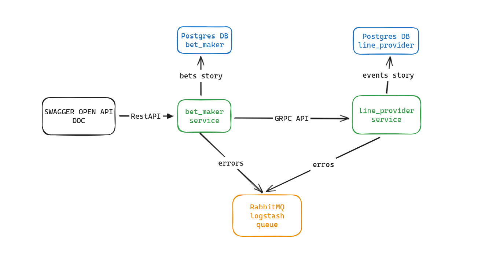

### Описание проекта

Система для игровых ставок.

Проект построен на микросервисной архитектуре.

Первый микросервис называется `line-provider`. Он предоставляет возможность работы со всеми данными о событиях (events).
Для взаимодействия с этим микросервисом используется gRPC, так как все запросы происходят в реальном времени.
Данные хранятся в базе данных PostgreSQL. Планы по интеграции Redis для кэширования и уменьшения однотипных запросов
к PostgreSQL были отменены из-за нехватки времени.

Второй микросервис называется `bet-maker`. Его задача — предоставлять возможность работы со ставками на определенные
события. Он взаимодействует с микросервисом `line-provider` через gRPC. Кроме того, у `bet-maker` есть REST API для
взаимодействия, так как он является шлюзом. Для API используется FastAPI. Для сохранения ставок также используется 
PostgreSQL.

Есть микробиблиотека `bet_library`, которую в идеале можно было бы вынести в отдельный репозиторий и использовать во
всех микросервисах при необходимости.

Логирование в обоих сервисах включает информацию об ошибках, отладке, информационных и исключениях. Логи ошибок и 
исключений записываются в файлы (без отладочных и информационных сообщений для упрощения мониторинга), а критические
ошибки отправляются в RabbitMQ.

Все сервисы написаны асинхронно и используют только асинхронные библиотеки.

### Пайплайн



### Стек технологий:

- `python3.10`
- `docker` & `docker-compose`
- `PostgreSQL`
- `RabbitMQ`
- `Redis`
- `FastAPI`
- `Pydantic`
- `Uvicorn`
- `gRPC`
- `SQLAlchemy ORM`
- `asyncpg`

### Запуск приложения

Запуск приложения выполнен максимально просто через Docker:

1. Убедитесь, что у вас установлен Docker.
2. Запустите оркестрацию Docker Compose:
   ```bash
   # запускаем инфраструктуру (postgres, rabbitmq, redis)
   sudo docker compose -f docker-compose-infra.yml up
   Или запустите в фоновом режиме:
   sudo docker compose -f docker-compose-infra.yml up -d
   
   # запускаем сервисов bet-maker & line-provider (postgres, rabbitmq, redis)
   sudo docker compose -f docker-compose-bet-apps.yml up
   Или запустите в фоновом режиме:
   sudo docker compose -f docker-compose-bet-apps.yml up -d
3. Перейдите по адресу: http://localhost:8001/

### Возможные улучшения
- Обработка ошибок
- Улучшение архитектуры
- Написание функциональных юнит-тестов и интеграционных тестов для всех эндпоинтов
- Добавление инструментов, таких как Alembic, для будущего расширения проекта
- Добавление метрик

### Итоги
Так как старался показать свои навыки в разных технологиях как gRPC, postgres, fastapi, sqlalchemy, rabbitmq и так далее,
   не хватило времени написать все ендпоинты (ручки), также не успел сделать backcall функцию на сторону line-provider которая публиковала бы известие
в rabbitmq, а потом
 на сторону bet-maker создал бы отдельный маленький сервис consumer-finished-bets который обновлял бы вставки в постгрес кто выиграл/проиграл

### Генерация grpc .proto команду, если необходимо.
```
python -m grpc_tools.protoc -I. --python_out=. --grpc_python_out=. ./line_provider/src/grpc/grpc_api.proto
```